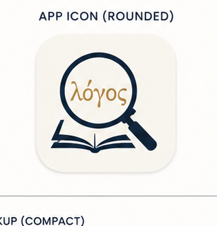
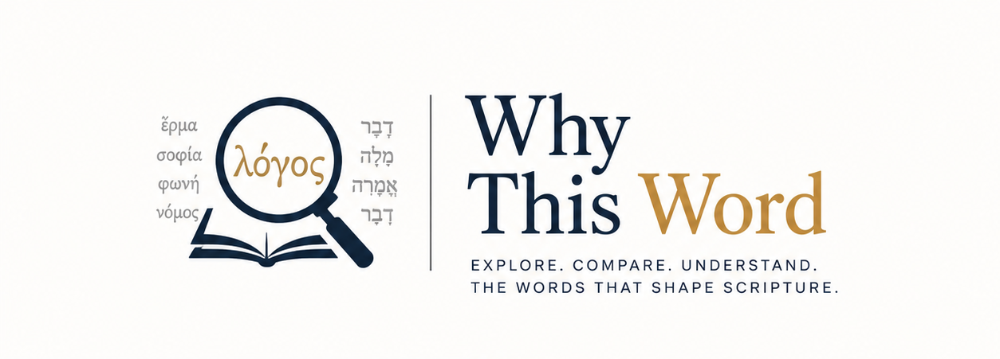

# <p align="center"></p>

<p align="center">
  <strong>A Contrastive-Semantics Reader for the Greek New Testament</strong>
</p>

<p align="center">
  
</p>

---

**Why This Word** is a quiet, scholarly reading companion for the Greek New Testament. Instead of offering direct interlinear decoding or dogmatic commentary, it is built around a single question: **Why did the author choose this word, and not a nearby alternative?**

By surface-level parsing, Koine Greek synonyms often overlap. This tool helps students, seminarians, and pastors explore the precise theological and rhetorical nuances that tilt in or out when a different term is swapped in.

---

## 🎨 Visual Preview

Here is the dark/light responsive branding assets available in the repository:

| Light Mode Brand Logo | Dark Mode Brand Logo |
| :---: | :---: |
|  |  |

---

## ✨ Features

*   **Interactive Greek Reader:** Click any Koine Greek word to open its detailed linguistic, morphological, and semantic profile.
*   **Semantic Neighbors:** Curated lists of nearby terms with defined overlaps and distinctions in typical usage.
*   **Contrastive Analysis ("What Changes?"):** Academically hedged, comparative notes detailing what shade of meaning shifts if a synonym stood in place of the author's choice.
*   **Deep Linkable Routing:** Fully synchronized URL state via TanStack Router search parameters (`?w=token-id`). Sharing a URL shares the exact selected word view.
*   **Responsive Desktop/Mobile Layout:** Optimized three-column layout on desktop and clean sheet overlays on mobile.
*   **Print-Inspired Aesthetic:** Beautiful typography utilizing GFS Didot and EB Garamond, styled with oklch colors under light/dark modes.

---

## 🛠️ Technology Stack

*   **Framework:** [TanStack Start](https://tanstack.com/router/v1/docs/start/overview) (React, Router, Query, SSR)
*   **Styling:** Tailwind CSS v4 (CSS-first configuration)
*   **Icons:** Lucide React
*   **UI Primitives:** Radix UI via shadcn/ui
*   **Build/Deployment:** Vite + Wrangler (Cloudflare Pages adapter)
*   **Package Manager:** Bun (recommended) or npm

---

## 🚀 Quick Start

### 1. Prerequisites
Make sure you have [Node.js](https://nodejs.org/) and [Bun](https://bun.sh/) installed.

### 2. Install Dependencies
```bash
bun install
# or: npm install
```

### 3. Run Development Server
```bash
bun dev
# or: npm run dev
```
Open [http://localhost:3000](http://localhost:3000) to view the application in the browser.

### 4. Build for Production
To build the application for deployment on Cloudflare Pages:
```bash
bun run build
# or: npm run build
```

---

## 📁 Repository Structure

```
├── assets/                 # Brand assets, logos, and icons
├── public/                 # Static public assets
├── src/
│   ├── components/
│   │   ├── ui/             # Reusable shadcn/ui Radix primitives
│   │   ├── site-chrome.tsx # Headers and footers
│   │   ├── verse-reader.tsx# Interactive text reader
│   │   └── word-analysis-panel.tsx # Dictionary & contrastive side-panel
│   ├── hooks/              # Custom hooks (theme management, search history)
│   ├── lib/
│   │   └── corpus/         # Static scripture and lexicon mock datasets
│   ├── routes/             # TanStack Router page routing layout
│   ├── styles.css          # Tailwind CSS v4 stylesheet
│   ├── main.ts             # App client entrypoint
│   └── server.ts           # App server entrypoint (SSR)
├── tsconfig.json           # TypeScript configuration
├── vite.config.ts          # Vite bundler configuration
└── wrangler.jsonc          # Cloudflare deployment settings
```

---

## 🗺️ Roadmap & Future Development

For a deep dive into how to extend this project beyond the static mock prototype phase, refer to:
*   [ROADMAP.md](ROADMAP.md) - Features a 5-phase transition plan covering real corpus ingestion (SBLGNT/MorphGNT), LLM-augmented semantic synthesis (Gemini/AI), comparative workspaces, and user study persistence features.
