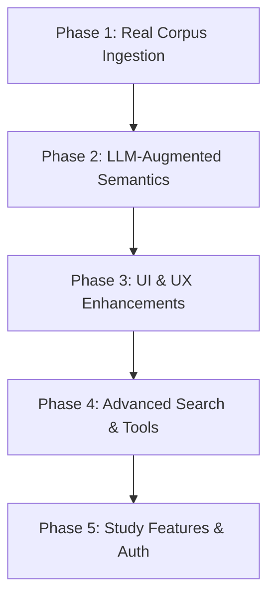

# Why This Word — Future Roadmap & Next Steps

This document outlines the next stages of development for **Why This Word**, a contrastive-semantics reader for the Greek New Testament (GNT). It is designed to guide future agents and developers in transitioning the application from a mock-data prototype to a production-ready, AI-augmented tool for biblical scholars and students.

---

## 1. Project Concept & Core Value Proposition

**Why This Word** is a reading companion built around a single, highly specific questions:

> _Why did the biblical author choose this particular word, and not a nearby alternative?_

### Academic & Hedged Tone

Unlike traditional dictionaries or dogmatic commentary tools, this application maintains a careful, academically hedged tone:

- **Encouraged terminology:** _"may suggest," "can imply," "often associated with," "possibly emphasizes," "could tilt."_
- **Discouraged terminology:** _"definitely means," "the author intended to," "this proves that,"_ or any other absolute theological declarations.

---

## 2. Current Architecture & Codebase Overview

The MVP is built on a modern, high-performance web stack:

- **Framework:** [TanStack Start](https://tanstack.com/router/v1/docs/start/overview) (React-Router-based React Framework with Server-Side Rendering support).
- **Styling:** Tailwind CSS v4 featuring CSS-first theme configuration under [src/styles.css](file:///home/DART/jonathant/Documents/WhyThisWord/src/styles.css).
- **State Management:** TanStack Router search parameters (`?w=token-id`) for selected words, ensuring page states are fully bookmarkable and shareable.
- **Deployment:** Integrated with Cloudflare Pages via `@cloudflare/vite-plugin` and configured in [wrangler.jsonc](file:///home/DART/jonathant/Documents/WhyThisWord/wrangler.jsonc).
- **UI Components:** Built using Radix UI primitives styled via Tailwind (see [src/components/ui/](file:///home/DART/jonathant/Documents/WhyThisWord/src/components/ui)).

### Key Data Contracts

Data structures are defined in [src/lib/corpus/types.ts](file:///home/DART/jonathant/Documents/WhyThisWord/src/lib/corpus/types.ts):

- `GreekToken`: Individual word representations with morphology and glosses.
- `Verse`: Multi-token containers with matching English text.
- `Passage`: Multi-verse Scripture blocks.
- `WordAnalysis`: Contrastive-semantics data package including:
  - `neighbours`: Curated synonyms with overlap, distinction, usage, and implications.
  - `examples`: Real-world Koine Greek usage examples.

---

## 3. Critical Critique of the Current MVP Stage

While the visual foundation and aesthetic direction are exceptional, several critical architectural gaps remain:

1.  **Brittle Interactivity & Clickability Rules:**
    In [src/components/verse-reader.tsx](file:///home/DART/jonathant/Documents/WhyThisWord/src/components/verse-reader.tsx#L28), clickability is determined by an arbitrary rule:
    ```typescript
    const isClickable = t.lemma.length > 1 && t.morph !== "Article, nom. masc. sg.";
    ```
    This prevents users from clicking nominative masculine singular articles but allows them to click other case forms of the article (e.g., `τὸν` or `τῇ`). A robust data-driven clickability system is required.
2.  **No Visual Indication of Detailed Content:**
    Users must click blindly to find which words have detailed contrastive notes (e.g., `λόγος`, `θεός`) and which ones only display the basic morphology block in the [WordAnalysisPanel](file:///home/DART/jonathant/Documents/WhyThisWord/src/components/word-analysis-panel.tsx).
3.  **Static & Limited Mock Dataset:**
    The Greek text and semantic analyses are entirely hardcoded in static mock files under [src/lib/corpus/mock/](file:///home/DART/jonathant/Documents/WhyThisWord/src/lib/corpus/mock/). The app currently supports only five passages.
4.  **Lack of General Dictionary Fallbacks:**
    If a lemma does not have a curated comparison entry, it displays a rudimentary "no analysis" notice. There is no automated fallback to standard dictionaries (e.g., Abbott-Smith, Thayer, or Strong's definitions).
5.  **No AI Semantic Synthesis:**
    Creating contrastive-semantic analysis for all 5,000+ distinct lemmas in the GNT is too massive for a manual editorial process. The MVP has no integration to dynamically synthesize these analyses using an LLM.

---

## 4. Technical Roadmap for Future Agents

Future agents should execute the following phases to build a production-grade application.



### Phase 1: Real Corpus Ingestion & Morphology Database

_Goal: Replace mock passages with a complete, parsed Greek New Testament._

1.  **Ingest Public Domain Texts:**
    - Incorporate the **SBLGNT** (SBL Greek New Testament) or **Westcott-Hort** (1881) text.
    - Develop an ingestion script (stored under `/scripts/`) to parse SBLGNT XML/JSON databases into the `Passage` and `Verse` formats.
2.  **Integrate Morphology Databases:**
    - Pull full part-of-speech and case parsing from **MorphGNT** or **Tauber's GNT** databases.
    - Map token coordinates securely so that each word carries its grammatical categories (e.g., case, gender, number, voice, mood, tense).
3.  **Implement Standard Dictionary Lookup:**
    - Provide a fallback parser using Abbott-Smith or Strong's definitions when custom semantic reviews are unavailable.

---

### Phase 2: LLM-Augmented Semantic Synthesis

_Goal: Dynamically generate contrastive semantics for words on-the-fly and cache the results._

1.  **Setup AI Integration:**
    - Leverage the **Gemini API** (using the model `gemini-2.5-pro` or `gemini-2.5-flash`) via Cloudflare Workers or Firebase AI Logic.
2.  **Prompt Engineering (Semantic Analysis):**
    - Design a strict prompt template that forces the LLM to output a JSON object adhering to the `WordAnalysis` type in [src/lib/corpus/types.ts](file:///home/DART/jonathant/Documents/WhyThisWord/src/lib/corpus/types.ts).
    - Inject the surrounding verse context so the LLM understands the context-specific nuance.
    - **Prompt Guidelines:**

      ```markdown
      You are a cautious Koine Greek seminary tutor. Analyze the word [LEMMA] in the context of [VERSE_REF] ([GREEK_TEXT]).
      Provide:

      1. Pronunciation (IPA) and short morphological summary.
      2. Glosses.
      3. A brief definition of the word's primary meaning.
      4. 2-4 semantic neighbours (synonyms in Koine Greek). For each neighbour:
         - Overlap: how they are similar.
         - Distinction: how they differ.
         - Typical usage: where they are normally found.
         - Implication: why the author preferred the target lemma in this specific context.
         - If Replaced: a translation/nuance diff if the author had chosen the neighbour.
      5. 2-3 usage examples from other biblical or classical literature.

      CRITICAL: Keep your tone academic, hedged, and non-dogmatic. Use words like "may suggest", "often associated with", "could imply". Avoid declaring absolute authorial intent.
      ```
3.  **Caching Layer (Cloudflare D1 / KV):**
    - Since LLM calls are expensive and slow, query a local SQLite database (Cloudflare D1 or Supabase) first.
    - If the analysis for a lemma in a given context is missing, invoke the Gemini API, display the result to the user, and write the response to the cache for future visitors.

---

### Phase 3: UI & UX Enhancements

_Goal: Improve typography, visual markers, and customization for readers._

1.  **Add Visual Cues for Curated Words:**
    - Add a subtle decoration (e.g., a dotted underline in the theme's `--color-accent-scholar`) to Greek words that have curated analyses (either pre-written or cached).
    - Leave other words clickable, but styled normally, to trigger general dictionary fallbacks.
2.  **Introduce Reader Customization Panel:**
    - **Greek Font Size Adjuster:** Let users increase/decrease the font size of the Greek text (useful for reading complex diacritics).
    - **Show/Hide English Toggle:** Allow students to hide the English text to test their reading comprehension.
    - **Interlinear Mode Toggle:** Display inline English glosses beneath the Greek words for quick scanning.
3.  **Incorporate Audio Pronunciation:**
    - Add a speaker icon next to the lemma in [src/components/word-analysis-panel.tsx](file:///home/DART/jonathant/Documents/WhyThisWord/src/components/word-analysis-panel.tsx).
    - Integrate Erasmian and Modern Greek pronunciation audio files or run an on-the-fly phonetics-to-audio converter.

---

### Phase 4: Comparative Workspace & Advanced Search

_Goal: Provide workspaces for side-by-side analysis and complex queries._

1.  **Synonym Compare Mode:**
    - Allow users to select two arbitrary lemmas (e.g., comparing `ἀγαπάω` and `φιλέω` side-by-side) and view a comparison matrix detailing differences in tense, semantic fields, and NT usage frequency.
2.  **Grammatical and Lemma Search:**
    - Enhance the search bar in [src/components/passage-picker.tsx](file:///home/DART/jonathant/Documents/WhyThisWord/src/components/passage-picker.tsx) to handle:
      - Scripture references (e.g., "John 3", "Jn 3:16").
      - Greek lemmas directly (e.g., searching for `πίστις` returns all verses where it occurs, acting as a concordance).

---

### Phase 5: Study Features & User Accounts

_Goal: Drive user retention through persistence features._

1.  **Bookmarking & History:**
    - Extend `useRecentPassages` to support bookmarks and user-saved vocabulary lists.
2.  **Notes & Highlighting:**
    - Let users highlight specific tokens or verses and append custom study notes to specific lemmas in their reader view.
3.  **Authentication:**
    - Integrate Firebase Auth or Supabase Auth to persist bookmarks, notes, and preferences across devices.

---

## 5. Verification Plan & Quality Benchmarks

### Automated Tests

- Ensure that the ingestion script compiles and correctly structures raw texts into the `Passage` data model.
- Write unit tests for the passage reference parser to verify that searches like "Jn 3:16", "John 3:16", and "1 Jn 1:1" map correctly to their database IDs.
- Verify that `WordAnalysis` objects generated by the AI strictly match the Zod validation schemas.

### Design and Accessibility Standards

- Ensure high contrast ratio (`> 4.5:1`) for text elements under light and dark modes, particularly with the scholar accent (`--color-accent-scholar`).
- Ensure full keyboard accessibility (`Tab` traversal) for clicking Greek tokens in [src/components/verse-reader.tsx](file:///home/DART/jonathant/Documents/WhyThisWord/src/components/verse-reader.tsx).
- Test responsive layouts on narrow mobile viewports (e.g. iPhone SE) to ensure the bottom Sheet component functions fluidly.
